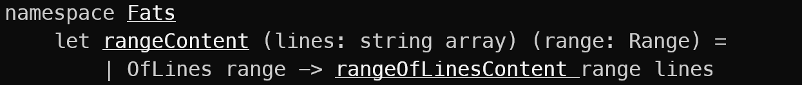

fats
====

fats is a cat-like dotnet tool to quickly dump multiple F# ranges from multiple files to stdout.  
Please note: F# ranges use 1-based lines and 0-based columns.  
Given a single path to a `.sarif` file, fats will dump the regions from the sarif results.

# Installation
```shell
dotnet tool install --global fats
```

# Usage
```
USAGE: fats.exe [--help] [--nomarkup] [<paths>...]

PATHS:

    <paths>...            the ranges to dump

OPTIONS:

    --nomarkup            don't use console markup like bold or underline
    --noprefix            don't dump line content before the range
    --nopostfix           don't dump line content after the range
    --help                display this list of options.
```

A single `path` argument consists of a file path followed by an optional colon and a range in parentheses.  
Two types of ranges are currently supported:
- `(startLine-endLine)` - a range of lines
- `(startLine,startColumn-endLine,endColumn)` - a range of characters  
- `(line,column)` - a range of a single line  

Between start and end line/column numbers there can be a single dash or multiple dashes.  
The default output style is to print whole lines and to markup the exact range with an underline and a bold font. See the usage to control this.

Examples:
```shell
> fats "./src/Fats/Program.fs:(1,0-1,4)" "./src/Fats/Program.fs:(3,0--4,0)" "./src/Fats/Program.fs:(5,0--5,10)"
```



```shell
> fats --nomarkup "./src/Fats/Program.fs:(1,0-1,4)" "./src/Fats/Program.fs:(3,0--4,0)" "./src/Fats/Program.fs:(5,0--5,10)"
namespace Fats
module Model =

    type Line =
```

```shell
> fats  --nomarkup "./src/Fats/Program.fs(1-3)" # lines 1 to 3
namespace Fats

module Model =
```

```shell
> fats  --nomarkup "./src/Fats/Program.fs:(1,3)" # line containing the position
namespace Fats
```

```shell
> fats --nomarkup ./testbed.sarif
GRA-STRING-002: The usage of String.StartsWith with a single string argument is discouraged. Signal your intention explicitly by calling an overload.
C:/Users/schae/src/testbed/Library.fs(6,11)
        if name.StartsWith("world") then
---
```
